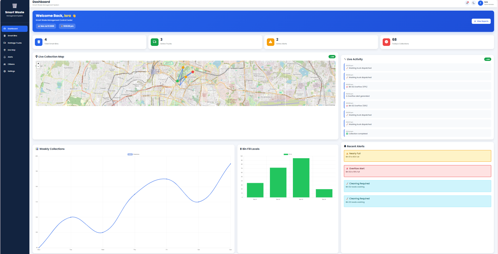
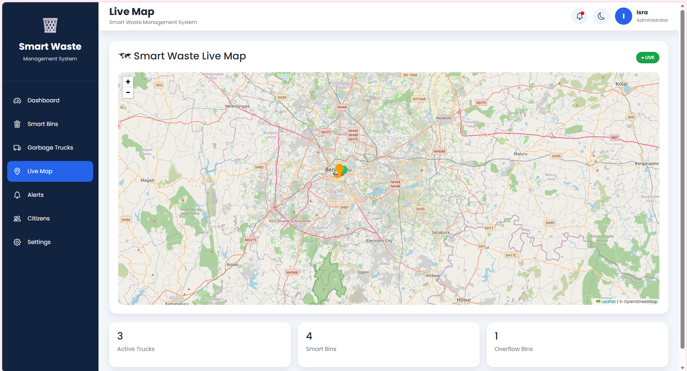
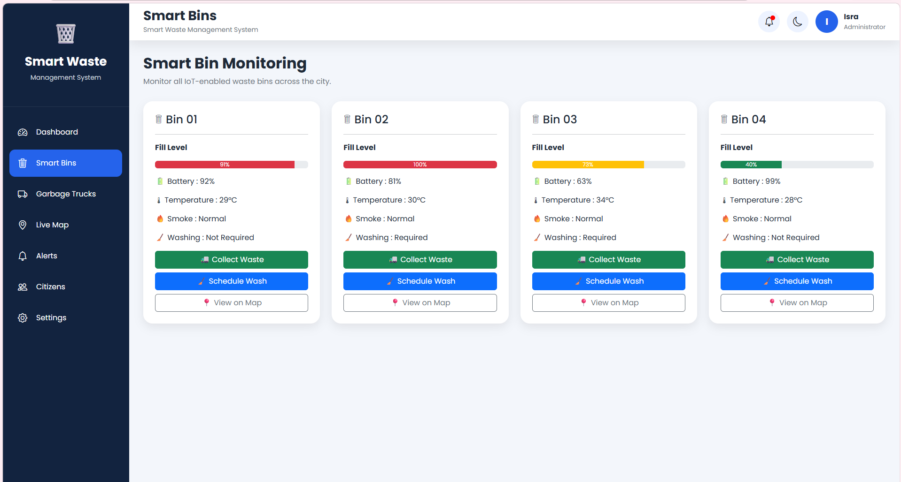
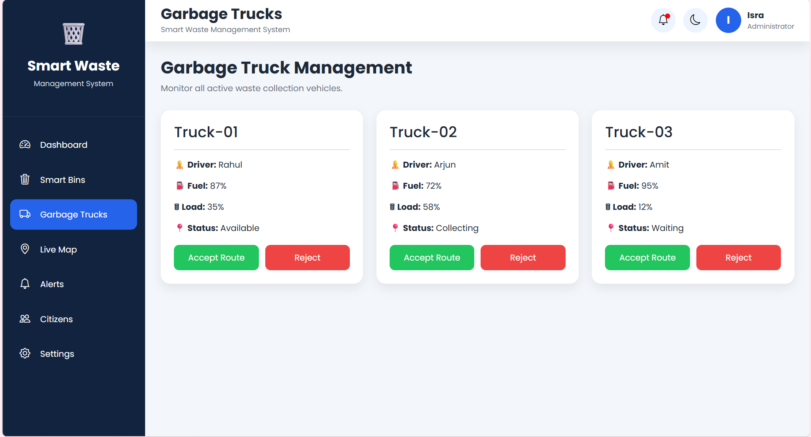
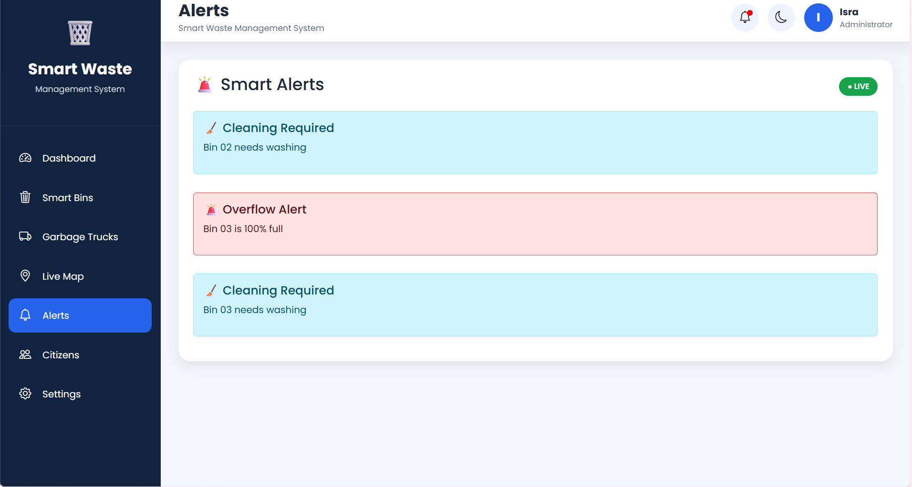
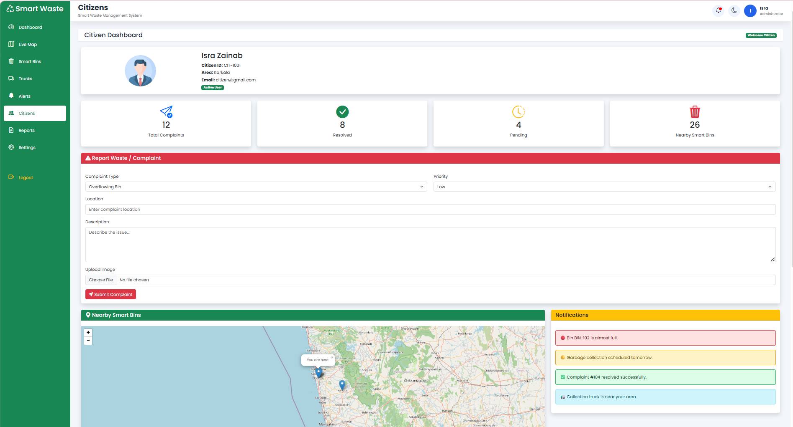
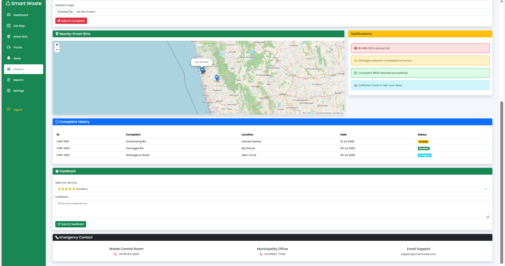

# ♻️ Smart Waste Management System

An IoT-enabled web application that helps municipal authorities monitor, manage, and optimize waste collection in real time. Smart bins report fill levels, GPS-enabled trucks are tracked live, and a centralized dashboard connects authorities, drivers, workers, and citizens — reducing manual monitoring, preventing overflow, and improving collection efficiency.


---

## 📖 Table of Contents

- [Overview](#overview)
- [Features](#features)
- [User Roles](#user-roles)
- [Tech Stack](#tech-stack)
- [Project Structure](#project-structure)
- [Getting Started](#getting-started)
- [Screenshots](#screenshots)
- [Roadmap](#roadmap)
- [Contributing](#contributing)

---

## Overview

Traditional waste collection relies on fixed schedules and manual inspection, which wastes fuel, misses overflowing bins, and leaves citizens with no way to report issues. This project simulates a full IoT-driven pipeline — smart bins, GPS trucks, live maps, and role-based dashboards — so that collection is data-driven instead of guesswork.

Built as a resume-ready, placement-quality final year project, every module (Admin, Driver, Worker, Citizen, Live Map, Alerts, Reports) is interconnected so an action in one portal reflects across the system.

## Features

### 🗑 Smart Bin Monitoring
- Real-time fill level tracking with color-coded status (🟢 0–50% · 🟡 51–79% · 🔴 80–100%)
- Temperature, fire, tilt, and lid-status sensors
- Battery level and last collection timestamp

### 🚛 Smart Truck Tracking
- Live GPS location and route progress
- Fuel level, capacity, and maintenance status
- Automatic **nearest-truck assignment** based on proximity, availability, capacity, and fuel

### 🗺 Live Map (Leaflet.js)
- Real-time bins, trucks, workers, drivers, routes, municipal office, and disposal center on one map

### 📢 Smart Alerts
- Automatic alerts for bin overflow, fire detection, sensor failure, truck breakdown, low fuel, worker emergencies, and route delays
- Priority levels: 🔴 High · 🟡 Medium · 🟢 Low

### 📊 Dashboard & Reports
- Live stat cards (active bins, trucks, workers, drivers, today's collections, citizen reports, fuel usage)
- Charts for collection trends, bin fill analytics, and performance
- Exportable daily/weekly/monthly reports (PDF, Excel, Print)

### 📱 Notifications
- Real-time updates across roles (shift started, truck returned, complaint received, emergency collection, etc.)

### 🔐 Authentication
- Separate secure logins for Admin, Driver, Worker, and Citizen
- Registration, forgot password, remember me, session handling

## User Roles

| Role | Key Capabilities |
|------|-------------------|
| 👨‍💼 **Admin** | Monitor all bins/trucks/workers, assign routes, manage users & settings, view reports and complaints |
| 🚛 **Driver** | View assigned truck & route, live navigation, update trip status, report breakdowns, monitor fuel |
| 👷 **Worker** | Manage shifts, view assigned bins, report damage/roadblocks with photos, complete collection tasks |
| 👤 **Citizen** | Report overflowing bins with images, track complaint status, view nearby bins, give feedback |

## Tech Stack

**Frontend:** HTML5, CSS3, Bootstrap 5, JavaScript
**Maps:** Leaflet.js
**Charts:** Chart.js
**Data:** LocalStorage + custom JS database (`smart-city-db.js`)
**Version Control:** Git & GitHub

> Locations used for the simulated bin/truck data are concentrated in the **Udupi district** (Udupi Bus Stand, City Market, Manipal Circle, Karkala, Brahmavar, Malpe Beach, Kaup, Kundapura, Moodbidri).

## Project Structure

```
smart-waste-management/
├── admin/                  # Admin portal (dashboard, reports, user management)
├── driver/                 # Driver portal (trips, navigation, fuel)
├── worker/                 # Worker portal (shifts, tasks, issue reporting)
├── citizen/                # Citizen portal (complaints, feedback)
├── shared/
│   ├── css/                # Shared stylesheets
│   ├── js/
│   │   ├── smart-city-db.js   # Local data layer (bins, trucks, users)
│   │   ├── auth.js             # Login/session handling
│   │   ├── map.js              # Leaflet live map logic
│   │   └── alerts.js           # Alert generation & priority logic
│   └── assets/              # Icons, images
├── index.html               # Landing / role selection page
└── README.md
```

*(Adjust this tree to match your actual folder layout — this is a suggested structure for a clean, GitHub-friendly repo.)*

## Getting Started

### Prerequisites
- A modern browser (Chrome, Edge, Firefox)
- [VS Code](https://code.visualstudio.com/) + Live Server extension (or any static file server)

### Installation

```bash
git clone https://github.com/<your-username>/smart-waste-management.git
cd smart-waste-management
```

Open `index.html` with Live Server, or run a quick local server:

```bash
python -m http.server 8000
```

Then visit `http://localhost:8000` in your browser.

### Demo Logins
| Role | Username | Password |
|------|----------|----------|
| Admin | admin@demo.com | demo123 |
| Driver | driver@demo.com | demo123 |
| Worker | worker@demo.com | demo123 |
| Citizen | citizen@demo.com | demo123 |

*(Replace with your actual seeded demo credentials once auth is wired up.)*

## Screenshots

> Add screenshots or a short GIF walkthrough here once your UI is ready — this section sells the project instantly to recruiters browsing GitHub.

### Admin Dashboard



### Live Map



### Smart Bins



### Garbage Trucks



### Alerts



### Citizen Dashboard



#### Complaint History and Feedback



## Roadmap

- [ ] AI-based bin fill prediction
- [ ] Waste generation forecasting
- [ ] AI-driven route optimization
- [ ] Image-based waste detection
- [ ] Illegal dumping detection
- [ ] Backend migration (Node/Express + real database)
- [ ] Real IoT sensor integration (replacing simulated data)

## Contributing

This is currently a solo academic/portfolio project, but suggestions and issues are welcome — feel free to open an issue or fork the repo.

*Built as a final-year project demonstrating full-stack web development, real-time systems design, and role-based application architecture.*
